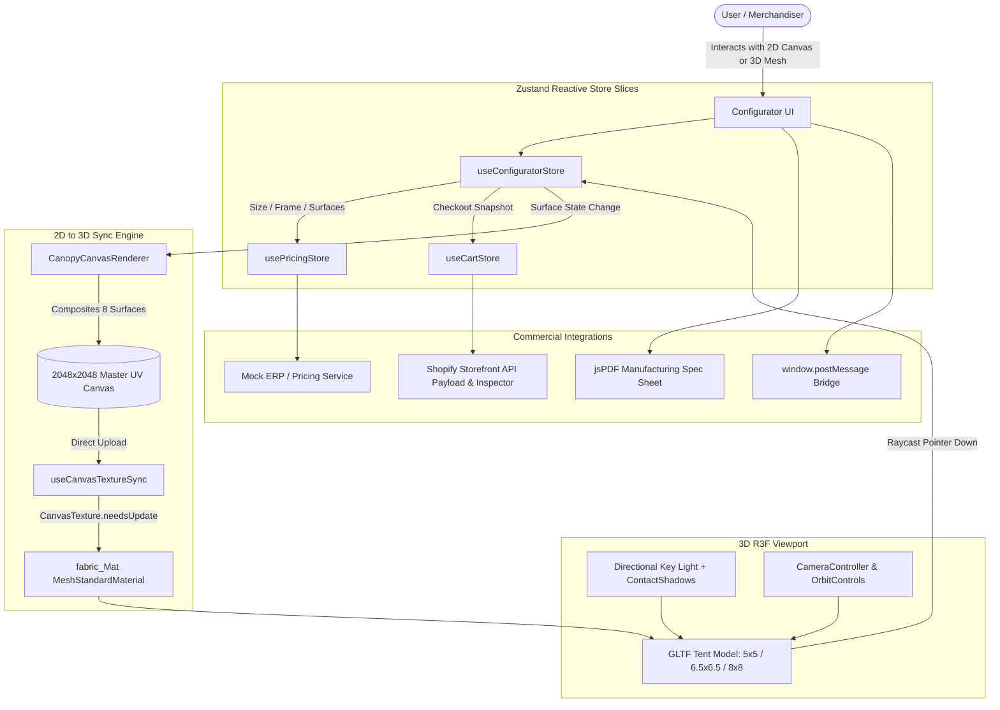

# MVP Visuals • 3D + 2D Interactive Canopy Tent Configurator

An enterprise-grade, production-ready 3D/2D custom canopy tent configurator engineered for high-concurrency e-commerce (Shopify / Headless Storefronts), dynamic print pricing, real-time WebGL synchronization, and vector manufacturing cut-sheet generation.

Built with **React 19**, **Three.js**, **@react-three/fiber**, **@react-three/drei**, **Zustand**, and **Tailwind CSS**.

---

## 1. System Architecture & Data Flow



---

## 2. 2D ⟷ 3D Real-time Synchronization Strategy

### The Single-Atlas Zero-Flicker Pipeline
Typical naive 3D customizer implementations swap multiple dynamic textures across different mesh sub-parts or regenerate WebGL materials every time a color changes. This causes noticeable viewport stutter, white flashes, and frequent GPU pipeline recompilation.

Our architecture solves this through an **Offscreen 2048x2048 Master Atlas Compositor**:
1. **Accurate UV Registration**: We inspected the exact `TEXCOORD_0` coordinate buffers in the source GLTF meshes (`Tent_5_5.glb`, `Tent_6.5_6.5.glb`, `Tent_8_8.glb`) and mapped the 8 printable canopy surfaces:
   - Front Peak (`U: 0.258 - 0.742, V: 0.537 - 0.867`)
   - Back Peak (`U: 0.260 - 0.745, V: 0.135 - 0.465`)
   - Left Peak (`U: 0.121 - 0.450, V: 0.280 - 0.720`)
   - Right Peak (`U: 0.550 - 0.863, V: 0.280 - 0.720`)
   - 4 Perimeter Valance Strips (Front, Back, Left, Right)
2. **Synchronous Canvas Pipeline**: Whenever text, logos, or colors are edited in the 2D panel, `CanopyCanvasRenderer.compositeMasterAtlas()` redraws the modified section into the master offscreen canvas.
3. **Hardware Texture Flag**: `texture.needsUpdate = true` instructs WebGL to stream only the dirty pixels to GPU VRAM without tearing down or rebinding shaders.
4. **Interactive 3D Raycasting**: Clicking any canopy facet in the 3D viewport computes the collision quadrant and selects that corresponding surface in the 2D customizer.

---

## 3. WebGL Performance & Memory Optimizations

- **Clamped Device Pixel Ratio (DPR)**: `dpr={[1, 2]}` prevents 3x/4x mobile screens (e.g. iPhone Retina / 4K displays) from rendering redundant sub-pixels that throttle mobile GPUs.
- **Explicit Texture & Geometry Disposal**: In `useCanvasTextureSync.ts`, `texture.dispose()` is bound to lifecycle cleanups to prevent WebGL context memory leaks over prolonged browsing sessions.
- **Model Preloading**: All 3 GLB sizes (5x5, 6.5x6.5, 8x8) are pre-cached via `useGLTF.preload()`, enabling zero-latency size switching without network waterfall delays.
- **Camera Damping & Floor Clamping**: `OrbitControls` polar angle is strictly clamped to `Math.PI / 2 - 0.03`, ensuring the camera never clips through the studio floor.
- **Soft Contact Shadows**: Rendered with `@react-three/drei` `ContactShadows` onto an invisible ground plane for crisp contact occlusion without expensive high-poly depth maps.

---

## 4. Dynamic Pricing Engine & Business Rules

Located in `src/services/pricingService.ts`:
- **Base Pricing**:
  - 5ft x 5ft: **$489**
  - 6.5ft x 6.5ft: **$629**
  - 8ft x 8ft: **$779**
- **Commercial Frame Surcharge**:
  - White Commercial Steel: **$0** (Included)
  - Heavy Duty 50mm Hex Aluminum Pro: **+$145**
- **MVP Visuals Print Fee Rule**:
  - **First 2 printed locations are included FREE** with every tent.
  - Each additional customized location adds a standard **$35** sublimated ink & plate fee.
- **Debounced ERP Latency**: Pricing updates are debounced by 150ms with `AbortController` cancellation to handle rapid user slider dragging without race conditions.

---

## 5. Shopify Storefront Integration Layer

### Storefront AJAX API (`POST /cart/add.js`)
Standard line item properties passed for custom manufacturing orders:
```json
{
  "id": "gid://shopify/ProductVariant/74920184910288",
  "quantity": 1,
  "properties": {
    "_tent_size": "8x8",
    "_frame_type": "hex_aluminum_pro",
    "_accessories": "Heavy Duty Roller Bag",
    "_customized_surfaces_count": 2,
    "_customized_summary": "front_peak (1 text, 0 logos) | front_valance (1 text, 0 logos)",
    "_manufacturing_ref_id": "MVP-CANOPY-M9Q1L2-4821",
    "_print_fee": "$0.00 (2 printed surfaces)",
    "_pdf_spec_url": "https://orders.mvpvisuals.com/specs/MVP-CANOPY-M9Q1L2-4821.pdf"
  }
}
```

### Storefront GraphQL API (`cartLinesAdd`)
Inspectable directly in the app via the **Shopify Payload Inspector** modal with 1-click copy for theme developers.

---

## 6. Manufacturing Spec Sheet (PDF Cut-Sheet)

Clicking **"Export Spec Sheet (PDF)"** invokes `src/components/pdf/SpecSheetGenerator.ts`:
- Extracts high-resolution 3D canvas proof snapshot.
- Generates 2D flat print previews of each customized panel.
- Itemizes engineering specifications (leg diameter, wind rating, fabric weight).
- Formats customer order reference number, pricing breakdown, and production date.

---

## 7. Iframe Embedding & `window.postMessage` Bridge

The configurator can be embedded in any Shopify Liquid page:
```html
<iframe
  src="https://customizer.mvpvisuals.com"
  width="100%"
  height="750px"
  frameborder="0"
  allow="camera; accelerometer"
></iframe>
```

### Supported Events:
- Outgoing: `CONFIGURATOR_READY`, `CONFIGURATOR_CHANGE`, `ADD_TO_CART_SUCCESS`
- Incoming: `SET_TENT_SIZE`, `SET_FRAME_TYPE`, `TRIGGER_CART_ADD`
- Interactive simulator available via the **Iframe / Embed Simulator** button on the bottom-left.

---

## 8. Development Commands
```bash
# Start local development server
npm run dev

# Run TypeScript check & production bundle build
npm run build
```
